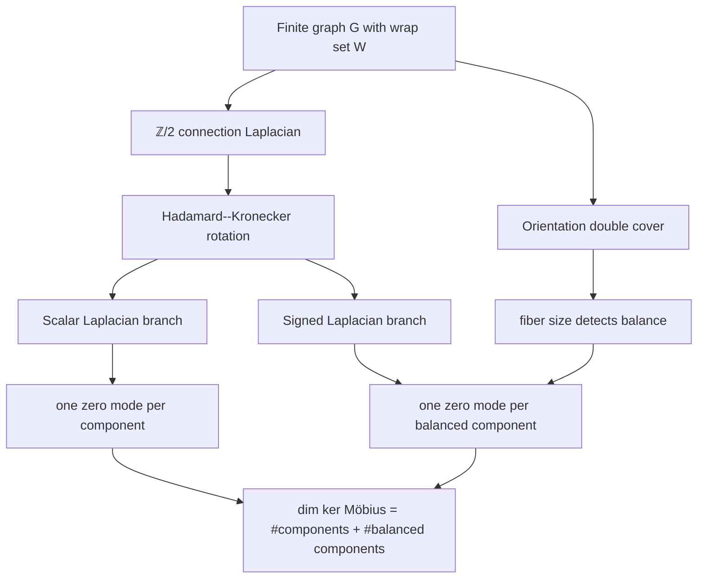

# Connection Laplacian infographic

This page is a compact overview for talks, thesis notes, and repository
navigation.

## Proof pipeline



## Formula card

| Object | Kernel count |
| --- | --- |
| Flat connection Laplacian | `2 · #components` |
| Scalar branch | `#components` |
| Signed branch | `#balanced components` |
| Möbius connection Laplacian | `#components + #balanced components` |

## Recognition card

```text
balanced component
  ⇔ every closed walk has even wrap parity
  ⇔ the orientation double-cover fiber has size 2
  ⇔ the signed Laplacian has a zero mode on that component
```

## Repository map

```text
ConnectionLaplacian.lean
├─ Basic.lean
├─ KernelDimension.lean
├─ CycleSpectrum.lean
├─ L5_Cover.lean
├─ L6_Cohomology.lean
├─ L8_Recognition.lean
├─ L9_Bounds.lean
├─ L10_CoverCharpoly.lean
├─ L11_Trees.lean
├─ L12_WalkH1.lean
├─ L13_PSD.lean
├─ L14_CycleEw.lean
├─ L15_BridgeMonotone.lean
├─ L16_SpectrumUnion.lean
└─ L17_TracesAndLipschitz.lean
```

## Talk-track summary

1. Start with a graph whose edges may flip the two-sheet fiber.
2. Rotate the block Laplacian into scalar and signed branches.
3. Count scalar zero modes by connected components.
4. Count signed zero modes by balanced components.
5. Recombine the branches to obtain the kernel dimension of the original
   connection Laplacian.
